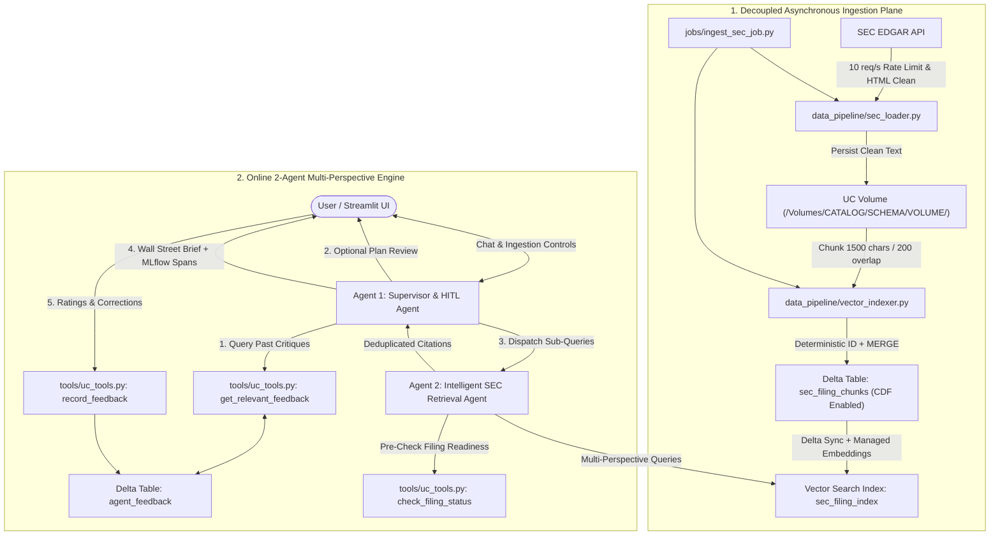

# Databricks 2-Agent SEC Intelligence System

A production-grade, Databricks-native 2-Agent investment research engine featuring **decoupled asynchronous ingestion**, **multi-perspective vector retrieval**, **Delta-backed human-in-the-loop (HITL) memory**, and **Unity Catalog governance**.

---

## 🏗️ Architecture Overview



---

## 🌟 Key Features

1. **Decoupled Asynchronous Ingestion Plane**:
   - Heavy SEC EDGAR downloads, HTML sanitization, and vector indexing run in the background or via standalone Serverless Databricks Jobs without freezing the UI or timing out online chat agents.
   - Text files are preserved as clean, governed assets directly in Unity Catalog Volumes: `/Volumes/{CATALOG}/{SCHEMA}/{VOLUME_NAME}/`.
2. **Granular SEC Discovery & Selective Ingestion**:
   - Search SEC filings by **Form Type** (`10-K`, `10-Q`, `8-K`), **Fiscal Year**, **Fiscal Quarter** (`Q1`, `Q2`, `Q3`, `Q4`), or **Custom Date Range**.
   - Live index status badges (`✅ Indexed` vs `⚪ Ready to Ingest`).
   - Select specific filings or ingest the full batch with one click.
3. **Deduplication Prevention & Idempotency**:
   - Deterministic chunk IDs: `{ticker}_{form}_{accession}_{chunk_index}`.
   - Delta `MERGE INTO` guarantees that re-ingesting a filing updates existing records without creating duplicate vector chunks.
4. **Intelligent 2-Agent Orchestration**:
   - **Agent 1 (Supervisor & HITL)**: Retrieves historical memory, formulates the analytical plan, supports user review before execution, and synthesizes an executive brief.
   - **Agent 2 (Intelligent SEC Retriever)**: Pre-checks filing availability, generates 2–3 targeted technical sub-queries, queries the Databricks Vector Search Delta Sync index, deduplicates chunks, and structures citations.
5. **Delta-Backed HITL Memory**:
   - User critiques, ratings, and ground-truth corrections are saved into `{CATALOG}.{SCHEMA}.agent_feedback`.
   - Supervisor automatically retrieves past critiques for that company and dynamically injects them into future planning and synthesis prompts.
6. **Databricks Managed MCP & Agents SDK Integration**:
   - Built on `from agents import Agent, Runner, handoff`.
   - Connects to Databricks managed MCP endpoints: `https://<workspace-hostname>/api/2.0/mcp/functions/{catalog}/{schema}` using `DatabricksMCPClient`.
   - Dynamically imports registered Unity Catalog functions over MCP without manual boilerplate decorators.
   - Delegates from Supervisor to Subagent (`SEC_Retrieval_Agent`) via native agent `handoffs`.
7. **Full Observability**:
   - Native MLflow tracing captures spans for `supervisor_plan`, `retrieval_agent`, and `final_synthesis`.
   - Standard HTTP and OpenAI loggers are silenced to keep production logs clean.

---

## 📁 Repository Manifest

```text
.
├── .gitignore                # Git exclusions (Python bytecode, .venv, Databricks secrets)
├── app.yaml                  # Databricks App deployment specification (Port 8501)
├── requirements.txt          # Python dependencies (Databricks SDK, Vector Search, MLflow, etc.)
├── config.py                 # Configuration sourcing env vars with production defaults
├── setup_infra.py            # Automated UC Catalog, Schema, Volume, Delta, & VS endpoint setup
├── app.py                    # Streamlit app (Discovery, Ingestion, Chat, HITL Plan Review, Feedback)
├── agent/
│   ├── __init__.py
│   ├── supervisor.py         # Agent 1: Planning, memory retrieval, HITL review, synthesis
│   └── retriever.py          # Agent 2: Pre-check, query decomposition, vector search & dedup
├── data_pipeline/
│   ├── __init__.py
│   ├── sec_loader.py         # Rate-limited SEC EDGAR discovery, HTML cleaning, UC Volume saving
│   └── vector_indexer.py     # Deterministic chunking, Delta CDF MERGE, Vector Search sync
├── jobs/
│   ├── __init__.py
│   └── ingest_sec_job.py     # Standalone CLI and Serverless batch ingestion job
└── tools/
    ├── __init__.py
    ├── uc_tools.py           # UC Tools: check_filing_status, record_feedback, get_relevant_feedback
    └── register_tools.py     # Registers UC functions via DatabricksFunctionClient
```

---

## ⚙️ Prerequisites

1. **Databricks Workspace**:
   - Unity Catalog enabled.
   - An active SQL Warehouse (Serverless or Pro).
2. **Model Serving Endpoint**:
   - Default: `databricks-meta-llama-3-3-70b-instruct` (or `databricks-dbrx-instruct` / `databricks-mixtral-8x7b-instruct`).
3. **Vector Search**:
   - Databricks Vector Search enabled on workspace.
   - Standard endpoint (default name: `sec_vs_endpoint`).
4. **Local / Databricks CLI Setup**:
   - Authenticated Databricks CLI (`databricks auth login`) or environment variables:
     ```bash
     export DATABRICKS_HOST="https://<your-workspace-url>.databricks.com"
     export DATABRICKS_TOKEN="dapi..."
     ```

---

## 🚀 Quickstart: Provisioning Infrastructure (`setup_infra.py`)

Run the automated infrastructure setup script once to provision the Catalog, Schema, Volume, Delta tables, UC functions, and Vector Search endpoint:

```bash
python setup_infra.py
```

### What this script creates:
1. **Catalog & Schema**: `investment_prod.sec_intelligence`
2. **Unity Catalog Volume**: `/Volumes/investment_prod/sec_intelligence/raw_filings/`
3. **Delta Memory Table**: `investment_prod.sec_intelligence.agent_feedback`
4. **Delta Chunks Table**: `investment_prod.sec_intelligence.sec_filing_chunks` (with Change Data Feed enabled)
5. **UC Governed Tools**: Registered via `DatabricksFunctionClient` with `replace=True`
6. **Vector Search Endpoint**: `sec_vs_endpoint` (STANDARD)

---

## 💻 Running the Application

### Option A: Deploy as a Databricks App (Recommended for Production)

Databricks Apps provides fully managed hosting for the Streamlit UI with unified authentication.

1. Ensure [`app.yaml`](file:///Users/I8798/Desktop/Databricks%20Agents/app.yaml) is configured:
   ```yaml
   command:
     - "streamlit"
     - "run"
     - "app.py"
     - "--server.port"
     - "8501"
     - "--server.address"
     - "0.0.0.0"
   env:
     - name: "DATABRICKS_CATALOG"
       value: "investment_prod"
     - name: "DATABRICKS_SCHEMA"
       value: "sec_intelligence"
     - name: "DATABRICKS_VOLUME"
       value: "raw_filings"
     - name: "VECTOR_SEARCH_ENDPOINT"
       value: "sec_vs_endpoint"
     - name: "SERVING_ENDPOINT"
       value: "databricks-meta-llama-3-3-70b-instruct"
     - name: "STREAMLIT_GATHER_USAGE_STATS"
       value: "false"
   ```

2. Create and deploy the Databricks App via Databricks CLI:
   ```bash
   # 1. Create the App
   databricks apps create sec-intelligence-agent

   # 2. Sync files and deploy
   databricks sync . /Workspace/Users/<your-username>/sec-intelligence-agent
   databricks apps deploy sec-intelligence-agent --source-code-path /Workspace/Users/<your-username>/sec-intelligence-agent
   ```

3. Open the Databricks Apps tab in your workspace and click **Open Application**.

---

### Option B: Running Locally with Databricks Authentication

1. Activate virtual environment and install requirements:
   ```bash
   python3 -m venv .venv
   source .venv/bin/activate
   pip install -r requirements.txt
   ```

2. Authenticate to Databricks:
   ```bash
   export DATABRICKS_HOST="https://<your-databricks-workspace>.cloud.databricks.com"
   export DATABRICKS_TOKEN="dapi..."
   ```

3. Launch the Streamlit application:
   ```bash
   streamlit run app.py
   ```
   Open your browser at `http://localhost:8501`.

---

## 📖 Step-by-Step User Guide

### 1. Ingesting & Indexing Filings (Sidebar)

1. **Step 1: Discover Filings**:
   - Enter a stock ticker (e.g. `NVDA`, `AAPL`, `MSFT`).
   - Select Form Types: check `10-K`, `10-Q`, and/or `8-K`.
   - Choose your filter mode:
     - **Year & Quarter**: Filter by fiscal year (e.g., `2024`) and quarter (`All`, `Q1`, `Q2`, `Q3`, `Q4`).
     - **Date Range**: Specify custom start and end dates.
   - Click **"🔎 Discover Filings on SEC EDGAR"**.
2. **Step 2: Select & Ingest**:
   - Review the discovered filings list with filing dates, period dates, accession IDs, and live indexing badges (`✅ Indexed` or `⚪ Ready`).
   - Pick the specific filings you want to analyze using the checkboxes, or click **"Select All Discovered"**.
   - Click **"📥 Ingest Selected"** or **"⚡ Ingest All"**.
   - Ingestion runs in the background. Check the **Background Ingestion Monitor** in the sidebar for live PID and completion status without blocking your chat session!

---

### 2. Conversational Analysis & HITL Plan Review

1. Set the **Active Query Ticker**, **Form**, and **Year** in the main header (e.g. `NVDA`, `10-K`, `2024`).
2. **HITL Plan Review Toggle**:
   - If **unchecked**: The agents execute planning, vector retrieval, and brief synthesis directly in one fluid pass.
   - If **checked ("Review Agent Retrieval Plan Before Execution")**:
     1. Supervisor Agent inspects Delta memory for past critiques on this company and designs targeted sub-queries.
     2. An interactive **HITL Review Card** appears in the UI displaying the analytical focus and planned vector sub-queries.
     3. You can edit the sub-queries directly in the UI.
     4. Click **"✅ Approve & Run"** to proceed with retrieval.
3. **Structured Research Brief**:
   - The final response includes an **Executive Summary**, **Financial Findings & Margins Breakdown**, **Risk Disclosures**, and **Explicit Source Citations** (e.g. `[NVDA 10-K 2024 | Chunk 1]`).

---

### 3. Continuous Learning via Delta-Backed HITL Feedback

Underneath every assistant response:
1. Open the **"💬 Provide Feedback / Correction for this Company"** expander.
2. Select **👍 Helpful** or **👎 Needs Correction**.
3. Enter feedback instructions (e.g., *"Always break out Data Center compute vs networking revenue"* or *"Do not include one-time legal settlements in operating margins"*).
4. Optionally enter a **Corrected ground truth / figure**.
5. Click **"Save Feedback to Unity Catalog Delta Table"**.
6. The feedback is persisted to `{CATALOG}.{SCHEMA}.agent_feedback`. On all future queries for this company, Supervisor Agent will retrieve and follow these instructions!

---

## 🛠️ Batch Ingestion via Databricks Jobs (CLI & Workflows)

You can run batch ingestion independently from the UI via CLI or schedule it as a Serverless Databricks Job:

```bash
# Discover filings only (metadata inspection)
python jobs/ingest_sec_job.py --ticker AAPL --forms 10-K 10-Q --year 2024 --discover-only

# Ingest specific form and quarter
python jobs/ingest_sec_job.py --ticker NVDA --form 10-Q --year 2024 --quarter Q3

# Ingest specific filing by accession number
python jobs/ingest_sec_job.py --ticker MSFT --accessions 000032019324000123

# Ingest a custom date range
python jobs/ingest_sec_job.py --ticker AAPL --forms 10-K --start-date 2024-01-01 --end-date 2024-12-31
```

### Scheduling as a Databricks Workflow Job:
In Databricks Workflows:
- Task Type: `Python script`
- Path: `jobs/ingest_sec_job.py`
- Parameters: `["--ticker", "NVDA", "--forms", "10-K", "10-Q", "--year", "2024"]`
- Cluster: Serverless Compute

---

## 🔒 Governance & Security

- **Dynamic Authentication**: Uses `databricks.sdk.WorkspaceClient` to inherit ambient permissions from Databricks Apps, Notebooks, or Jobs without hardcoded credentials.
- **Unity Catalog ACLs**: Delta tables and volumes respect standard Unity Catalog permissions (`GRANT SELECT`, `GRANT MODIFY`).
- **SEC EDGAR Compliance**: Adheres to SEC's 10 req/s rate limits and declared `User-Agent` headers.

